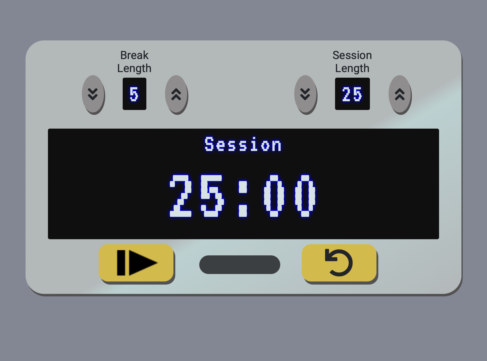

# 25 - 5 Clock (Pomodoro)

## How to Use

This pomodoro clock counts down predetermined time periods and automatically switches between the two when that current time period ends. An alarm sounds whenever the timer reaches 00:00. The yellow play/pause button on the left to starts and stops the timer. The yellow reset button on the right refreshes the clock back to its original state.

This was made as part of the freeCodeCamp Front End Development Libraries curriculum.

To see this live, please visit its CodePen page: https://codepen.io/macgirl212/full/gOxYwPj
